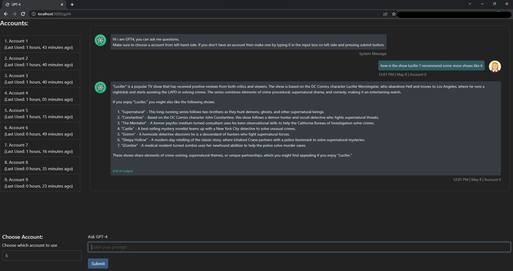
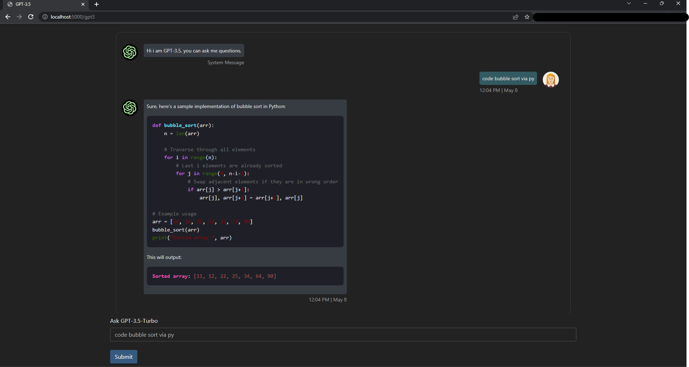

## Introduction

This repository provides a free and easy way to use two powerful language models, GPT-4 and GPT-3.5, for generating natural language text. These models are state-of-the-art and have shown impressive results across various NLP tasks.

The GPT-4 model is provided by forefront.ai, which allows you to generate up to 5 messages every 3 hours for free. The GPT-3.5 model is provided by Theb.ai and can be used without any restrictions.

## Getting started

To use the models, follow these simple steps:

1. Download this repository by clicking on the **Code** button and selecting **Download ZIP**. 
2. Extract the files to a folder of your choice.
3. Open a terminal window in the extracted folder.
4. Install the required Python packages by running `pip install -r requirements.txt`.
5. Run the script by typing `python main.py` in the terminal window.
6. Open your web browser and go to [localhost:5000](http://127.0.0.1:5000).

The script will automatically create and verify accounts for the language models, so you don't have to do it manually.

## Note

As mentioned earlier, forefront.ai has a limit of 5 messages per 3 hours for the GPT-4 model. This means that if you exceed this limit, you will have to switch accounts to continue using the model. 

## Credits

The GPT-4 model is based on [OpenGPT](https://github.com/uesleibros/OpenGPT) by uesleibros.

The GPT-3.5 model is provided by [Theb.ai](https://theb.ai) and can be used without any restrictions.

## Images

### GPT-4

### GPT-3.5-Turbo

## Stickers

